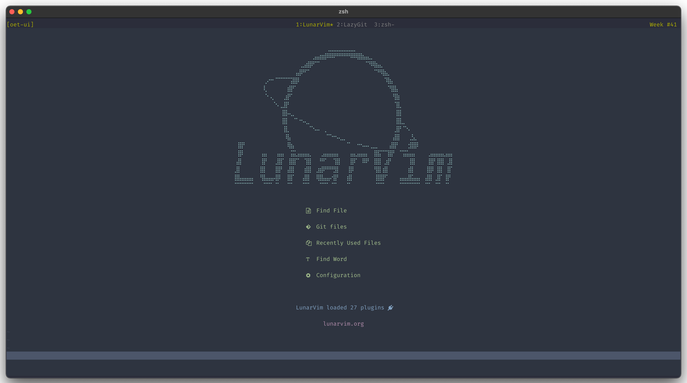
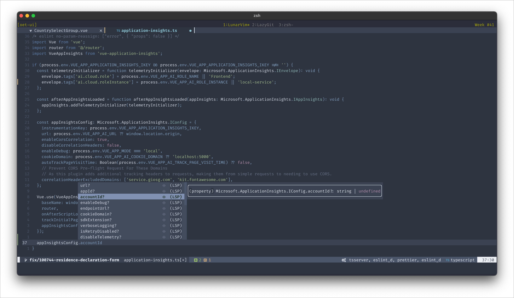
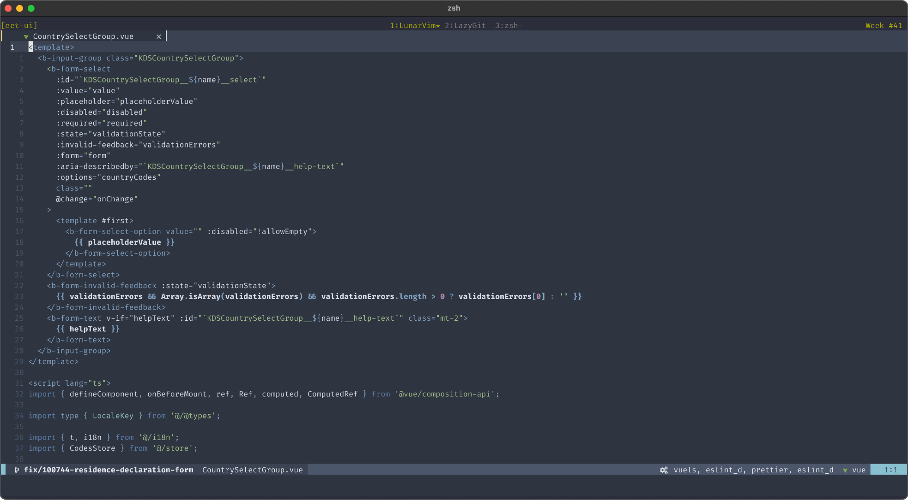
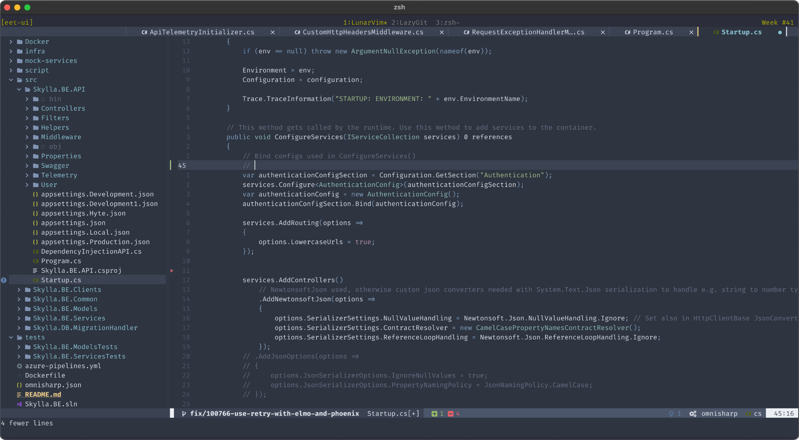

# My LunarVim configuration

- [Neovim](https://github.com/neovim/neovim) stable
- [LunarVim](http://github.com/LunarVim/LunarVim) rolling



I mainly use:

- TypeScript & JavaScript
  - Node
  - Vue
  - React
- C#
  - .NET (Core)
  - ASP.NET Core
- Python 3
- Lua
- Swift
  - iOS/iPadOS/macOS
- HTML & CSS
- Markdown & JSON & YAML
- Bash / Zsh / POSIX
- PowerShell

## Setup/Dependencies

### macOS (Homebrew)

```shell
# Homebrew
brew update
brew install neovim fzy luarocks ripgrep shellcheck shfmt fnm python@3.9
brew install font-fira-code-nerd-font

# Fast Node Manager
NODE_VERSION="14.18.1"
fnm install $NODE_VERSION
fnm default $NODE_VERSION
fnm use $NODE_VERSION

# NPM
npm install -g eslint_d markdownlint-cli neovim prettier stylelint yarn write-good

# PIP
pip3 install black isort flake8 pynvim

# LuaRocks
luarocks luacheck

# StyLua
STYLUA_VERSION="0.11.0"
cd ~/.local/bin
wget https://github.com/JohnnyMorganz/StyLua/releases/download/v${STYLUA_VERSION}/stylua-${STYLUA_VERSION}-macos.zip
unzip stylua-${STYLUA_VERSION}-macos.zip
rm stylua-${STYLUA_VERSION}-macos.zip
chmod +x stylua

# LunarVim (rolling)
LVBRANCH=rolling \
  bash <(curl -s https://raw.githubusercontent.com/lunarvim/lunarvim/rolling/utils/installer/install.sh)

# My LunarVim configuration
cd ~/.config
mv lvim lvim-original
git clone https://github.com/PasiBergman/lvim.git lvim-my
ln -s lvim-my lvim
```

### LunarVim

I have disabled the automatic installation of language servers.

```vim
:PackerSync
:LspInstall vuels omnisharp tsserver sumneko_lua pyright html cssls
:LspInstall jsonls yamlls vimls emmet_ls dockerls tailwindcss bashls
```

## Screenshots

- [Kitty](https://sw.kovidgoyal.net/kitty/) terminal emulator.
- [Nordic theme](https://github.com/andersevenrud/nordic.nvim)
- [FiraCode Nerd Font](https://github.com/ryanoasis/nerd-fonts/tree/master/patched-fonts/FiraCode)
- Tmux

Top row in the screenshots is Tmux status bar, not LunarVim.

TypeScript



Vue



C#


