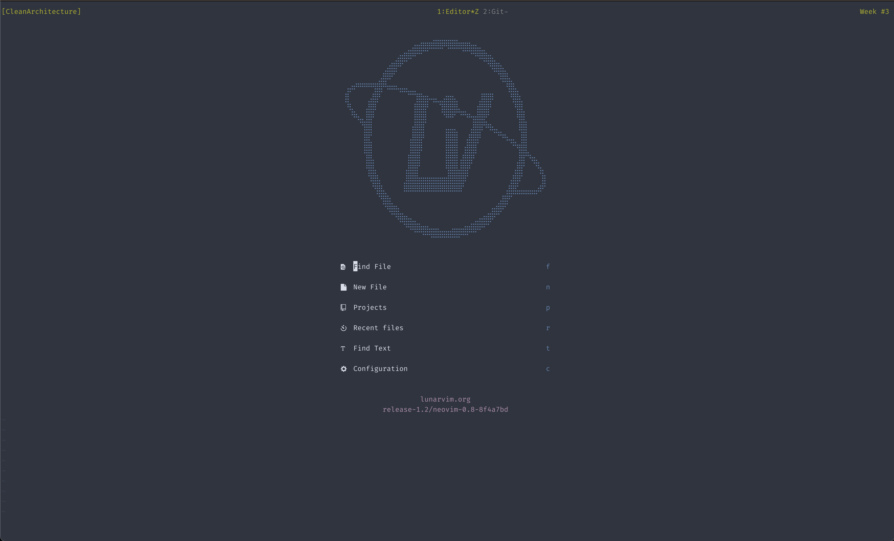
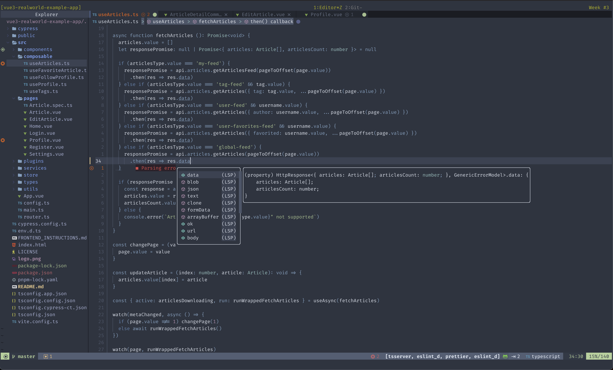
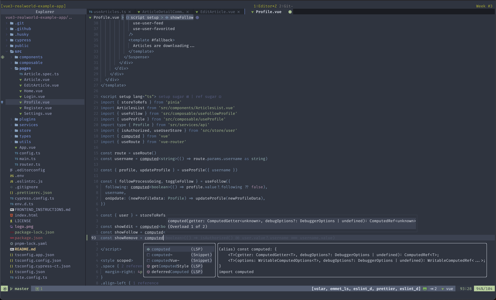
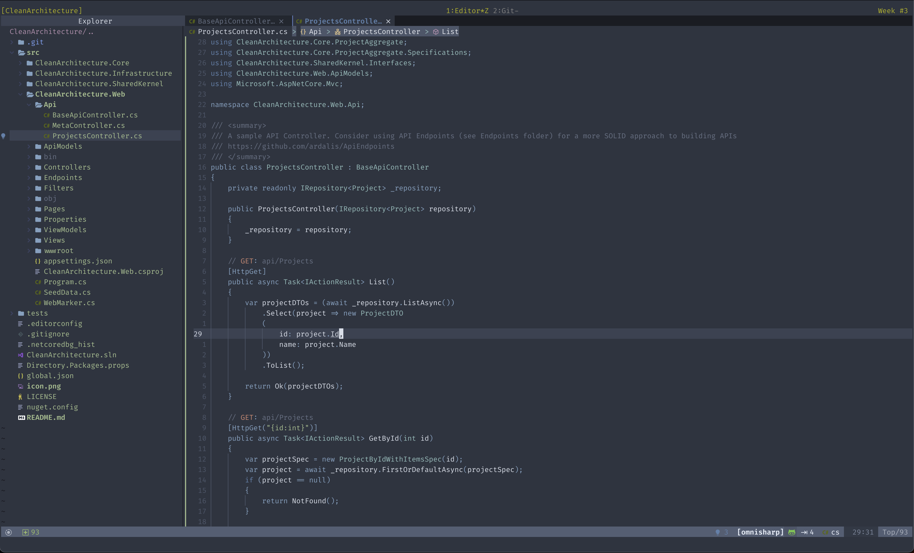

# My LunarVim configuration

- **LunarVim**? [LunarVim](https://www.lunarvim.org) is an opinionated, extensible,
  and fast IDE layer for **Neovim**.
- **Neovim**? Neovim is a project/editor that seeks to aggressively refactor **Vim**.
- **Vim**? DuckDuckGo/Google/Bing it!

## Usage



I mainly use:

- TypeScript & JavaScript
  - Node
  - Vue
  - React
- C#
  - .NET 6/7
  - ASP.NET Core 6/7
- Python 3
- Lua
- HTML & CSS
- Astro
- Markdown & JSON & YAML
- Bash / Zsh / POSIX
- PowerShell

I use [tmux](https://en.wikipedia.org/wiki/Tmux) with LunarVim. I switch from one
project to another using **tmux sessions**.

For tmux config details see my [dotfiles](https://github.com/PasiBergman/dotfiles).

## Setup/Dependencies

- [Neovim v0.8+](https://github.com/neovim/neovim)
- [LunarVim v1.2](https://github.com/LunarVim/LunarVim)

### Installation (macOS)

Installation on macOS v11+ using [Homebrew](https://brew.sh).

Note! You might have some of the applications and/or other dependencies already installed.

```shell
# Update Homebrew
# ---------------
brew update

# Install neovim, fnm and Python 3
# --------------------------------
brew install neovim fnm python

# Install some other dependencies
brew install fzy luarocks ripgrep shellcheck shfmt

# FiraCode Nerd Font
brew install font-fira-code-nerd-font

# Manually configure terminal emulator to use the installed nerd font

# Fast Node Manager & Node & NPM
# --------------------------------------
# Change the current NodeJS LTS version below
NODE_VERSION="18.12.1"
fnm install $NODE_VERSION
fnm default $NODE_VERSION
fnm use $NODE_VERSION

# NPM
# ---
# Neovim dependencies
npm install -g neovim tree-sitter-cli yarn
# Linters, formatters etc.
npm install -g eslint_d markdownlint-cli prettier stylelint write-good

# PIP
# ---
# Neovim dependency
pip3 install pynvim

# Pyhton linters/formatters
pip3 install black isort flake8

# Lua linter
# ----------
luarocks install luacheck

# Lua formatter
# -------------
STYLUA_VERSION="0.15.3"
cd ~/.local/bin
wget https://github.com/JohnnyMorganz/StyLua/releases/download/${STYLUA_VERSION}/stylua-macos.zip
unzip stylua-macos.zip
rm stylua-macos.zip
chmod +x stylua

# LunarVim v1.2
# ------------------
LV_BRANCH='release-1.2/neovim-0.8' \
  bash <(curl -s https://raw.githubusercontent.com/lunarvim/lunarvim/fc6873809934917b470bff1b072171879899a36b/utils/installer/install.sh)

# My LunarVim configuration
# -------------------------
cd ~/.config
mv lvim lvim-orig
git clone https://github.com/PasiBergman/lvim.git lvim-my
ln -s lvim-my lvim
```

### LunarVim configuration

Start `lvim` and issue the following commands:

```vim
:PackerSync
```

Check and modify installed language servers, debug adapters etc with `Mason`

```vim
:Mason
```

## Screenshots

- [Kitty](https://sw.kovidgoyal.net/kitty/) terminal emulator.
- [Nordic theme](https://github.com/andersevenrud/nordic.nvim)
- [FiraCode Nerd Font](https://github.com/ryanoasis/nerd-fonts/tree/master/patched-fonts/FiraCode)
- [tmux](https://en.wikipedia.org/wiki/Tmux)

Top row in the screenshots is tmux status bar, not LunarVim.

TypeScript



Vue



C#


